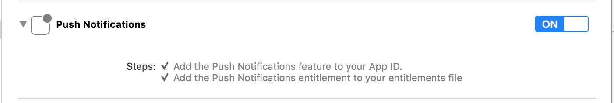
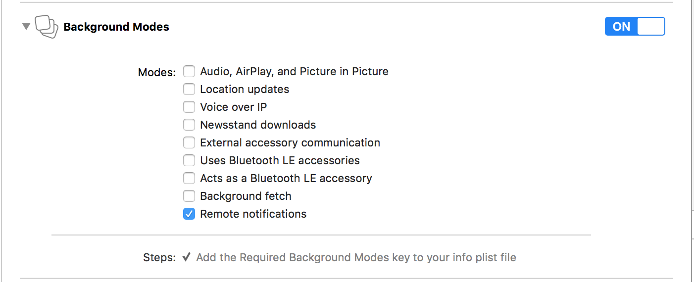

# Messages and Notifications

The Shout to Me platform allows you to enable your app to receive communications sent from Shout to Me's Broadcaster
Application.  Messages and notifications are two separate concepts in the Shout to Me system.  A **Message** is text,
audio or video content that is sent to mobile users to convey a communication.  A **Notification** is the delivery
mechanism used to transport a Message.

## Messages
The SDK provides a class that can be used to retrieve messages for the current user, or check if they have
unread messages.

```objc
// Request all of the messages for the current user.
- (void)requestForMessagesWithDelegate:(id<MessagesDelegate>)delegate;

// Request the count of unread messages for the current user.
- (void)requestForUnreadMessageCountWithDelegate:(id<MessagesDelegate>)delegate;

// Request a specific message by ID
- (void)requestForMessage:(NSString *)messageId completionHandler:(void (^)(STMMessage *message,
                                                                            NSError *error))completionHandler;
```

### Retrieving messages

Follow these steps to retrieve messages:

#### Import "STM.h" to the header of your view controller

```objc
//ViewController.h

#import <STM.h>
```

#### Implement the MessagesDelegate

```objc
//ViewController.h

@interface ViewController : UIViewController<MessagesDelegate>

@end
```

#### Request messages in your ViewController

```objc
//ViewController.m

- (void)viewDidLoad {
    [super viewDidLoad];
    [[STM messages] requestForMessagesWithDelegate:self];
}
```

#### Implement the MessagesResults method of  MessagesDelegate

```objc
//ViewController.m

#pragma mark - Messages Delegates
- (void)MessagesResults:(NSArray *)arrayMessages
{
    // Do something with arrayMessages, load them into a table view data source, etc.
}
```

### Get Unread Message Count

Follow these steps to get the unread message count:

#### Import "STM.h" to the header of your view controller

```objc
//ViewController.h

#import <STM.h>
```

#### Implement the MessagesDelegate
```objc

//ViewController.h

@interface ViewController : UIViewController<MessagesDelegate>

@end
```

#### Request unread message count in your ViewController

```objc
//ViewController.m

- (void)viewDidLoad {
    [super viewDidLoad];
    [[STM messages] requestForUnreadMessageCountWithDelegate:self];
}
```

#### Implement the UnreadMessageResults method of MessagesDelegate

```objc
//ViewController.m

#pragma mark - Messages Delegates
- (void)UnreadMessageResults:(NSNumber *)count {
    // Do something with count like setting a label's text, etc.
}
```


## Notifications
The Shout to Me SDK supports receiving push notifications from the Shout to Me platform.  The SDK will only handle
notifications sent from the Shout to Me system.  There are a number of components used in sending and receiving notifications,
and consequently, there are a number of items that need to be wired up. The following high level steps occur when a message
is sent from the Shout to Me system:

1. A message is sent from the Shout to Me Broadcaster Application
2. The message is delivered to the client app as an Apple Push Notification Service (APNs) notification
3. The client app passes the notification data received from iOS to the Shout to Me SDK
4. The Shout to Me SDK processes the notification data and calls a listener if applicable
5. A listener in the client app receives the call from the Shout to Me SDK and can take further action using the data

### Enable Project Capabilities
In your project Capabilities tab in Xcode, enable Push Notifications and Background Modes. Under Background Modes select Location Updates.
Location Updates allows the Shout to Me SDK to monitor the user's location in the background in order to delivery geo-targeted messages.
The Shout to Me SDK uses Apple's [Significant Change Location Service](https://developer.apple.com/documentation/corelocation/getting_the_user_s_location/using_the_significant_change_location_service)
to minimize power consumption.





### APNs Certificate
Pushing notifications requires the creation of an APNs certificate that is subsequently included in the app's provisioning profile.
Shout to Me will also use this certificate to register with its push notification platform.  Once these two items are done,
you will receive a push notification App ID that will be used to register for push notifications.
Contact Shout to Me to complete this process.
For more information, visit the [Apple Notification Programming Guide](https://developer.apple.com/library/content/documentation/NetworkingInternet/Conceptual/RemoteNotificationsPG/APNSOverview.html#//apple_ref/doc/uid/TP40008194-CH8-SW1).

### Enabling/Disabling Notifications
To enable or disable notifications at the user's request, add code that subscribes/unsubscribes to/from the specified channel.  The following code sample shows how to accomplish this.

#### Subscribe to / unsubscribe from a channel

```objc
[[STM user] subscribeTo:(NSString *)channelId withCompletionHandler:^(NSError *error, id channelSubscriptions) {
    if (error) {    
         NSLog(@"Error occurred subscribing to channel");
    } else {
         NSArray<NSString *> *channelSubscriptionsArray = channelSubscriptions;
         NSLog(@"Subscribe succeeded. New list of subscriptions: %@", channelSubscriptionsArray);
    }
}];
```

```objc
[[STM user] unsubscribeFrom:(NSString *)channelId withCompletionHandler:^(NSError *error, id channelSubscriptions) {
    if (error) {    
         NSLog(@"Error occurred unsubscribing from channel");
    } else {
         NSArray<NSString *> *channelSubscriptionsArray = channelSubscriptions;
         NSLog(@"Unsubscribe succeeded. New list of subscriptions: %@", channelSubscriptionsArray);
    }
}];
```

#### Follow / unfollow a topic
The Shout to Me system allows users to follow specific topics.  These examples show how to programmatically opt in and out of topics.

```objc
[[STM user] addTopicPreference:(NSString *)topic withCompletionHandler:^(NSError *error, id topicPreferences) {
    if (error) {
         NSLog(@"Error occurred following to topic");
    } else {
         NSArray<NSString *> *topicPreferencesArray = topicPreferences;
         NSLog(@"New list of topic preferences: %@", topicPreferencesArray);
    }
}];
```

```objc
[[STM user] removeTopicPreference:(NSString *)topic withCompletionHandler:^(NSError *error, id topicPreferences) {
    if (error) {
         NSLog(@"Error occurred unfollowing from topic");
    } else {
         NSArray<NSString *> *topicPreferencesArray = topicPreferences;
         NSLog(@"New list of topic preferences: %@", topicPreferencesArray);
    }
}];
```


### Notification Events

To integrate with the Shout to Me notification system, follow these instructions:

#### Implement the `STMDelegate` in `AppDelegate.h`

```objc
#import <STM.h>

@interface AppDelegate : UIResponder <UIApplicationDelegate, STMDelegate>
@property (strong, nonatomic) UIWindow *window;
@end
```

#### Include the following in your `didFinishLaunchingWithOptions` callback
First, call the `setupPushNotificationsWithAppId:(NSString *)pushNotificationAppId`
method with your App ID (see APNs Certificate above) to register for notifications from the Shout to Me system.
Then register to receive remote notifications from iOS.  Your specific registration may vary depending
on other types of notifications you receive, however, a simple registration is shown below.

(Note: The following iOS notification code is for iOS 10 and above.  You may need additional code to support iOS versions below iOS 10.)


```objc
- (BOOL)application:(UIApplication *)application didFinishLaunchingWithOptions:(NSDictionary *)launchOptions {

    // ...

    [STM setupPushNotificationsWithAppId:@"YOUR_APP_ID"];

    // Register for remote iOS notifications
    UNAuthorizationOptions options = UNAuthorizationOptionAlert + UNAuthorizationOptionSound + UNAuthorizationOptionBadge;
    UNUserNotificationCenter *center = [UNUserNotificationCenter currentNotificationCenter];
    center.delegate = self;
    [center requestAuthorizationWithOptions:(options) completionHandler:^(BOOL granted, NSError * _Nullable error) {
        if (!granted)
        {
            NSLog(@"One or more notification permissions are not granted.");
        }
        else if (!error)
        {
            [[UIApplication sharedApplication] registerForRemoteNotifications];
            NSLog(@"Push registration success.");
        }
        else
        {
            NSLog(@"Push registration FAILED");
            NSLog(@"ERROR: %@", error);
        }
    }];

    // ...
}
```

#### Implement the following iOS lifecycle events to pass required data to the Shout to Me SDK.

```objc
- (void)application:(UIApplication*)application didRegisterForRemoteNotificationsWithDeviceToken:(NSData*)deviceToken{
    [STM didRegisterForRemoteNotificationsWithDeviceToken: deviceToken];
}

- (void)application:(UIApplication*)application didFailToRegisterForRemoteNotificationsWithError:(NSError*)error{
    // There is no data to pass to the Shout to Me SDK, however, this method is helpful to troubleshoot push notification registration failures.
    NSLog(@"Failed to register with error : %@", error);
}

- (void)application:(UIApplication *)application didReceiveRemoteNotification:(NSDictionary *)userInfo fetchCompletionHandler:(void (^)(UIBackgroundFetchResult))completionHandler {
    [STM didReceiveRemoteNotification:userInfo ForApplication:application fetchCompletionHandler:completionHandler];
}
```

#### Implement the `STMNotificationsReceived` method to listen for Shout to Me notifications.

```objc
-(void)STMNotificationsReceived:(NSSet *)notification {

    // Each set can include 1 or more notifications.  Each notification is represented as a dictionary with the following fields:
    // @"alert":            Typically the body of a UI notification
    // @"category":         @"SHOUTTOME_MESSAGE" the identifier that alerts the Shout to Me SDK to act on the message
    // @"channel_id":       Your channel ID - necessary for apps containing multiple channels
    // @"message_type":             @"conversation message" for notifications directed at a whole channel or @"user message" for messages directed to a specific user
    // @"message_id":       The ID of the message stored in the Shout to Me system.
}
```

