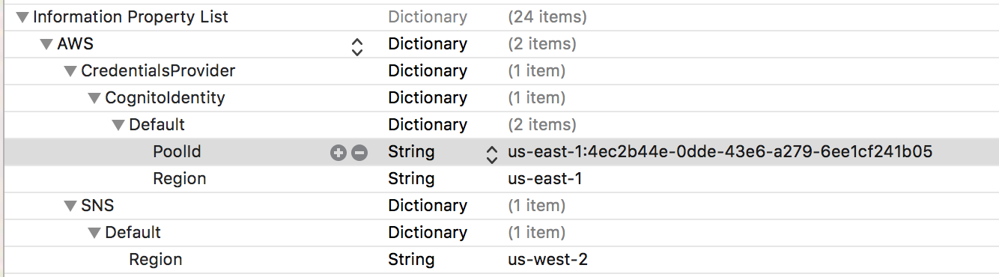

# Messages and Notifications

The Shout to Me platform allows you to enable your app to receive communications sent from Shout to Me's Broadcaster
Application.  Messages and notifications are two separate concepts in the Shout to Me system.  A **Message** is text or
audio content that is sent to mobile users to convey a communication.  A **Notification** (which is taken from the mobile
technology term "Push Notification") is the delivery mechanism used to transport a Message.

## Messages
The SDK provides a Messages class that can be used to retrieve Messages for the current user, or check if they have
unread messages.

```objc
// Request all of the users messages for the current user.
- (void)requestForMessagesWithDelegate:(id<MessagesDelegate>)delegate;
// Request the count of unread messages for the current user.
- (void)requestForUnreadMessageCountWithDelegate:(id<MessagesDelegate>)delegate;
// Request a specific message by Id
- (void)requestForMessage:(NSString *)messageId completionHandler:(void (^)(STMMessage *message,
                                                                            NSError *error))completionHandler;
```

### Retrieving messages

#### Import "STM.h" to the header of your view controller:

```objc
//ViewController.h

#import <STM.h>
```

#### Implement the MessagesDelegate:

```objc
//ViewController.h

@interface ViewController : UIViewController<MessagesDelegate>

@end
```

#### Request messages in your ViewController:

```objc
//ViewController.m

- (void)viewDidLoad {
    [super viewDidLoad];
    [[STM messages] requestForMessagesWithDelegate:self];
}
```

#### Implement MessagesDelegate MessagesResults delegate:

```objc
//ViewController.m

#pragma mark - Messages Delegates
- (void)MessagesResults:(NSArray *)arrayMessages
{
    // Do something with arrayMessages, load them into a table view data source...ect

    // Update the user's LastReadMessages date
    // If this is not updated, the call to requestForUnreadMessageCountWithDelegate will return
    // the same number even after the user views their messages.
    [[STM signIn] setLastReadMessages:[NSDate date] withDelegate:self];
}
```

### Get Unread Message Count

#### Import "STM.h" to the header of your view controller:

```objc
//ViewController.h

#import <STM.h>
```

#### Implement the MessagesDelegate:
```objc

//ViewController.h

@interface ViewController : UIViewController<MessagesDelegate>

@end
```

#### Request unread message count in your ViewController:

```objc
//ViewController.m

- (void)viewDidLoad {
    [super viewDidLoad];
    [[STM messages] requestForUnreadMessageCountWithDelegate:self];
}
```

#### Implement MessagesDelegate UnreadMessageResults delegate:

```objc
//ViewController.m

#pragma mark - Messages Delegates
- (void)UnreadMessageResults:(NSNumber *)count {
    // Do something with count, like setting a label's text, ect...
}
```


## Notifications
The Shout to Me SDK supports receiving push notifications from the Shout to Me platform.  The SDK will only handle
  notifications sent from the Shout to Me system.  There are a number of technologies used in receiving notifications,
  and consequently, there are a number of items that need to be wired up. The following high level steps occur in the
  notifications system:

1. A message is sent from the Shout to Me Broadcaster Application
2. The message is delivered to the mobile app as a Apple Push Notification Service notification
3. The Shout to Me SDK receives the notification and calls a listener
4. A listener in the client app receives the call and can take further action using the data

### Amazon AWS Configuration
The notification systems uses Amazon's AWS SNS platform.  As such, the SDK includes the AWS iOS SDK and must be configured properly to work. Add the following sections to your info.plist file.  (Note: If you already use the AWS iOS SDK and have conflicting values in your file, contact Shout to Me support.)

 

#### Implement the `STMDelegate` inside `AppDelegate.h`

```objc
#import <STM.h>

@interface AppDelegate : UIResponder <UIApplicationDelegate, STMDelegate>
@property (strong, nonatomic) UIWindow *window;
@end
```

#### Call `setupNotificationsWithApplication:application` to setup notifications inside of `didFinishLaunchingWithOptions` of the AppDelegate.

```objc
- (BOOL)application:(UIApplication *)application didFinishLaunchingWithOptions:(NSDictionary *)launchOptions {
    [STM setupNotificationsWithApplication:application];
}
```

#### Call related Shout to Me notification methods within the Remote Notification callbacks inside of the AppDelegate.

```objc
- (void)application:(UIApplication*)application didRegisterForRemoteNotificationsWithDeviceToken:(NSData*)deviceToken{
    [STM didRegisterForRemoteNotificationsWithDeviceToken: deviceToken];
}

- (void)application:(UIApplication *)application didReceiveRemoteNotification:(NSDictionary *)userInfo fetchCompletionHandler:(void (^)(UIBackgroundFetchResult))completionHandler {
    [STM didReceiveRemoteNotification:userInfo ForApplication:application fetchCompletionHandler:completionHandler];
}
```

#### Implement the `STMNotificationRecieved` to listen for Shout to Me notifications.

```objc
-(void)STMNotificationRecieved:(NSDictionary *)notification {
    // In this case we are posting a location notification so we can handle it in our app.

    UILocalNotification *localNotification = [[UILocalNotification alloc] init];
    localNotification.alertTitle = [Utils stringFromKey:@"title" inDictionary:notification];
    localNotification.alertBody = [Utils stringFromKey:@"body" inDictionary:notification];
    localNotification.userInfo = notification;

    [[UIApplication sharedApplication] scheduleLocalNotification:localNotification];
}
```

